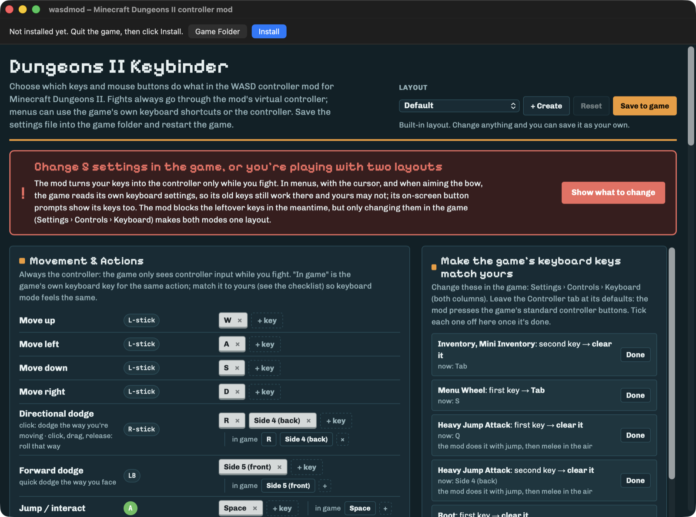

# wasdmod — WASD controls for Minecraft Dungeons II

Play **Minecraft Dungeons II (Minecraft Dungeons 2)** with **WASD, mouse and keyboard** instead of click-to-move, on Windows, Mac (CrossOver) and Linux.

wasdmod turns your keys into a virtual controller, so you get the game's full controller controls: smooth movement, dodges, artifacts and the menu wheel. Menus, the cursor and chat still work with the mouse and keyboard. The game itself isn't modified.

**Download:** [Windows](https://github.com/Wanzho/mcd2-wasd/raw/main/dist/wasdmod-Windows.exe) · [Mac](https://github.com/Wanzho/mcd2-wasd/raw/main/dist/wasdmod-Mac.dmg) · [Linux / Steam Deck](https://github.com/Wanzho/mcd2-wasd/raw/main/dist/wasdmod-manual.zip)

## Install

| System | Download |
|---|---|
| Windows | [**wasdmod-Windows.exe**](https://github.com/Wanzho/mcd2-wasd/raw/main/dist/wasdmod-Windows.exe) |
| Mac (CrossOver) | [**wasdmod-Mac.dmg**](https://github.com/Wanzho/mcd2-wasd/raw/main/dist/wasdmod-Mac.dmg) |
| Linux / Steam Deck, or Windows without the installer | [**wasdmod-manual.zip**](https://github.com/Wanzho/mcd2-wasd/raw/main/dist/wasdmod-manual.zip) |

Windows: the Steam version, or the game from Minecraft.net (Minecraft Launcher) or the Xbox app. Mac and Linux: the Steam version.

### Windows

1. Close the game and run **wasdmod-Windows.exe**.
2. If Windows says "Windows protected your PC", click **More info → Run anyway**. (The file isn't signed; that costs money every year.)
3. It finds the game in Steam, or in `XboxGames` for the Minecraft Launcher and Xbox app. If it doesn't, click **Browse…** and pick `Dungeons-Win64-Shipping.exe`.
4. Click **Install**, pick **Default** or **Recommended** under Key layout, and start the game.

### Mac

**The game has to run in CrossOver first.** If it doesn't yet, set it up with **[MCD2 Crossover](https://github.com/Wanzho/mcd2-crossover)**, which fixes Steam startup and Microsoft sign-in. Then:

1. Open **wasdmod-Mac.dmg** and drag **wasdmod** into **Applications**.
2. Open wasdmod. If macOS blocks it, approve it in **System Settings → Privacy & Security → Open Anyway**. Keep Gatekeeper enabled.
3. Quit the game, click **Install** at the top of the window, then start the game.

Install also sets three CrossOver options, for Dungeons II only (other games in the bottle keep their own settings): use wasdmod's `xinput1_4.dll` (Wine uses its own otherwise), send **Option** as Alt, and keep the cursor inside the game window. **Uninstall** removes them. (Versions before 1.0 set the last two for the whole bottle, which could throw the mouse around in other games there, like CS2; installing this version moves them to Dungeons II only.)

### Linux / Steam Deck (untested)

The game must already run under Proton. Then:

1. Unzip **wasdmod-manual.zip**.
2. In Steam, right-click the game → **Manage → Browse local files**, and open `Dungeons/Binaries/Win64`.
3. Copy `xinput1_4.dll` and `default.txt` there (and `author.txt` for the Recommended layout).
4. Right-click the game → **Properties → Launch Options**: `WINEDLLOVERRIDES="xinput1_4=n,b" %command%`

The same files work on Windows without the installer: skip step 4. For the Minecraft Launcher or Xbox app version, the folder is `C:\XboxGames\Minecraft Dungeons II\Content\Dungeons\Binaries\Win64` (or `XboxGames` on the drive you installed to).

## Controls

Two layouts are built in. **Default** is the game's own keyboard keys, played as a controller; only the menu wheel moves from S (now a movement key) to Tab. **Recommended** is the author's layout.

| Action | Default | Recommended |
|---|---|---|
| Move | W A S D | W A S D |
| Jump / interact | Space | Space or F |
| Melee (in the air: heavy jump attack) | Left click | Left click |
| Bow (hold it to aim with the mouse) | Right click | Side button 4 (back) |
| Directional dodge (hold and drag the mouse to roll that way) | R or side button 4 | Right click |
| Forward dodge | Side button 5 | Shift |
| Artifacts 1 / 2 / 3 | 1 / 2 / 3 | Q / 2 / 3 |
| Health potion | E | R |
| Guidance trail | Middle click | Middle click |
| Inventory | I | E |
| World map | M | M |
| Menu wheel | Tab | Tab |
| Quests | J | V |
| Social menu | F | / |
| Emotes | G | G |
| Collectibles | U | B |
| Event log | K | K |
| Teleport to player | X, F1–F4 | X, F1–F4 |
| Teleport statue | Z | Z |

**The menu wheel is on Tab.** The game's own key for it is S, which is "move down" here, so pressing Tab sends the game its S. Set **Menu Wheel** to Tab in the game (Settings → Controls → Keyboard) so keyboard mode matches.

In both layouts:

| Key | Does |
|---|---|
| Esc | Game menu |
| T | Typing mode: every key goes to the game until Esc; a banner shows while it's on |
| Alt (Option on a Mac) | Hold for the mouse cursor |
| F9 | Show or hide the on-screen key list (on a Mac keyboard: fn + F9, unless the F-keys are set as standard function keys) |
| Backtick (`) | Turn wasdmod off and on |

Opening a menu or moving the mouse switches to **mouse mode**: the cursor and keyboard work normally. Any fight key (WASD, Space…) switches back to the controller. Holding ⌘ (the Windows key on a PC) blocks every key, so system shortcuts never fire an ability.

## Change keys

The key layout editor is the main window of the Mac app. On Windows, click **Edit key layout…** in the installer; the editor opens in its own window, and the installer has to stay open while you edit.

- Pick **Default** or **Recommended** under Layout, or click **+ Create** for your own. Click a key to change it.
- Click **Save to game**, then restart the game.
- Changing a built-in layout asks to save it as a new layout of yours. **Reset** goes back to the saved version.

**Match the game's own keyboard settings.** The game reads its own keyboard settings in menus, with the cursor and while aiming the bow, and its on-screen button prompts show them too. If they differ from your layout, you're playing with two layouts. The red notice in the editor lists what to change in **Settings → Controls → Keyboard** (both columns), starting with the menu wheel on Tab. Leave the Controller tab at its defaults.

## Troubleshooting

### Nothing changes in game

Restart the game after installing. Press **F9**: if no key list appears, the mod isn't loaded.

- **Windows:** check that `xinput1_4.dll` is next to `Dungeons-Win64-Shipping.exe`. Antivirus may have removed it (see below).
- **Mac:** click **Install** again (it also sets the CrossOver options), then restart the game.

### Antivirus flags wasdmod

wasdmod reads the keyboard and presses controller buttons, and it isn't signed, so it looks like other input tools. Restore the file and allow it, or build it yourself from this repository.

### Holding Option doesn't show the cursor (Mac)

Click **Install** again: it sets CrossOver to send Option as Alt. Restart the game afterwards.

### Keys do their old thing in menus

Change the game's keyboard settings to match your layout (the red notice in the editor lists them).

### Stuck without a cursor, or stuck typing

Hold **Alt** for the cursor, press **Esc** to leave typing mode, or press **backtick (`)** to turn wasdmod off.

### Still broken? Record logs

1. In the wasdmod app (Mac) or `wasdmod-Windows.exe`, click **Record Logs**.
2. Play until the problem happens.
3. Come back and click **Stop & Save Logs**. A `wasdmod-logs-….txt` file appears on your Desktop.
4. [Open an issue](https://github.com/Wanzho/mcd2-wasd/issues/new), describe what happened and attach the file.

The file has the mod's log (every key and mouse button wasdmod handled while recording, and what it did with it), your key layout, and your system versions. Nothing you type is recorded, and keys your layout doesn't use show only as "other key".

Manual install: attach `wasdmod.log` from the game's `Dungeons/Binaries/Win64` folder. For the detailed log, put an empty file named `wasdmod-record.flag` there while you play.

## Turn off or uninstall

**In a running game:** press **backtick (`)**. wasdmod is back on when you press it again or restart the game.

**Turn it off** (your layouts are kept): the game starts without wasdmod until you turn it back on.

- **Windows:** run **wasdmod-Windows.exe** and click **Turn off** (later **Turn on**).
- **Mac:** open **wasdmod** and click **Turn Off** (later **Turn On**).
- **Manual install:** rename `xinput1_4.dll` to `xinput1_4.dll.off` (and back).

**Remove it for good:**

- **Windows:** run **wasdmod-Windows.exe** and click **Uninstall**.
- **Mac:** open **wasdmod** and click **Uninstall**.
- **Manual install:** delete `xinput1_4.dll`, `default.txt`, `author.txt` and any `wasdmod*.txt` from `Dungeons/Binaries/Win64`, and remove the launch option.

Steam's "Verify integrity of game files" doesn't remove wasdmod.

## Tested

Tested on an **M5 Pro with CrossOver 26.3**, with the game set up by MCD2 Crossover.

## Limitations

The Windows installer and mod are built and checked under Wine, but not yet tested on a Windows PC, and the Minecraft Launcher / Xbox app version of the game hasn't been tried. Linux / Steam Deck is untested. Online co-op hasn't been tested yet.

The game loads wasdmod as its controller driver; it doesn't edit the game's files or memory. It's still a third-party file inside the game folder, so use it at your own risk.

## For developers

### Advanced settings

Every option is explained in `default.txt`. A few worth knowing:

- `MouseMoveSwitches=0`: moving the mouse never leaves controller mode; only Alt, the menu keys or backtick give you the mouse.
- `CursorMode=Toggle`: Alt shows the cursor on one press and hides it on the next.
- `BowAimsWithMouse=1`: holding the bow button switches to mouse mode, so the game aims the bow at the cursor.
- `BumpNudgePct`: after a small mouse bump the game shows keyboard prompts; wasdmod flips it back with a tiny right-stick nudge. Lower it if you ever dodge by accident.
- `DisabledKeys` (filled in by the editor): the game's own keys for actions you moved to other keys. They never reach the game, in any mode. Left click is never disabled.

wasdmod uses the newest of `default.txt`, `author.txt` and any `wasdmod*.txt` in the game folder. The editor saves `default.txt` or `author.txt` for an unchanged built-in layout, otherwise `wasdmod-MMDDYY.txt`.

The Windows installer also has a command line: `/find`, `/status`, `/install`, `/uninstall`, `/default`, `/recommended`, `/own`, `/off`, `/on` (optionally followed by the game's Win64 folder).

### How it works

The DLL stands in for XInput: it reports controller 0 built from the keyboard and mouse, and forwards real controllers to the system's XInput. A message hook on the game's window threads hides the mapped keys and mouse (including the raw-input copies the game also reads), so the game sees only the controller and doesn't flicker between keyboard and controller mode. Text boxes are detected through Text Services (IMM as a fallback) and get the keyboard back.

Tried and dropped: patching the game's `GetCursorPos` import (the game quits 20–30 s later), a moving overlay window (lag under CrossOver) and `ClipCursor` (confined the mouse to the wrong area).

### Build and test

`./build.sh` (Apple clang, the lld-link from a Rust toolchain, and Xcode's Swift for the Mac app) builds:

- `build/xinput1_4.dll` and `build/test_load.exe`;
- `Keybinder.html` (from `configurator.html`);
- the downloads in `dist/`:
  - `wasdmod-Windows.exe` (`installer.c`);
  - `wasdmod-Mac.dmg` (`mac/main.swift` over `mac/wasdmod.sh`);
  - `wasdmod-manual.zip`.

No Windows SDK or C runtime is needed. `install.command` / `uninstall.command` install from the source folder.

`build/test_load.exe` runs inside a Wine bottle and checks the exports and the input filtering (gameplay, typing, menus, remaps, bow, text boxes). `smooth_test.c` and `dodge_test.c` test the movement smoothing and the drag dodge on the host.

## License

[MIT](LICENSE).

Headings in the key layout editor use [Mojang by b.tenthousand](https://fontstruct.com/fontstructions/show/836974) (CC0 public domain), with some glyphs and the spacing adjusted to match Minecraft's lettering.

Unofficial project. NOT AN OFFICIAL MINECRAFT PRODUCT. NOT APPROVED BY OR ASSOCIATED WITH MOJANG OR MICROSOFT. Not affiliated with CodeWeavers or Valve.

## References

Coded with Claude Opus 5.5.
